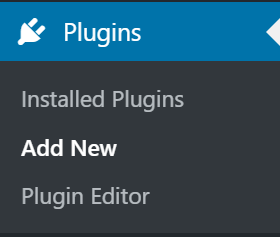

````markdown
# WP Headless with Next.js - Incremental Static Regeneration Example

This example showcases Next.js's [Incremental Static Regeneration (ISR)](https://nextjs.org/docs/basic-features/data-fetching/incremental-static-regeneration) feature using [WordPress](https://wordpress.org) as the data source. The setup allows us to build a high-performance, SEO-friendly blog powered by a headless WordPress CMS.

There are two approaches to setting up this headless WordPress with Next.js:

1. **Dockerized WordPress Setup**: Using Docker to containerize both WordPress and Next.js.
2. **External WordPress Setup**: Hosting WordPress externally and managing the connection via environment variables.

## Table of Contents

- [How to Use](#how-to-use)
- [Approach 1: Dockerized WordPress Setup](#approach-1-dockerized-wordpress-setup)
  - [Step 1: Set Up Docker Environment](#step-1-set-up-docker-environment)
  - [Step 2: Configure WordPress with WPGraphQL](#step-2-configure-wordpress-with-wpgraphql)
  - [Step 3: Setup Next.js](#step-3-setup-nextjs)
  - [Step 4: Run the Application](#step-4-run-the-application)
- [Approach 2: External WordPress Setup](#approach-2-external-wordpress-setup)
  - [Step 1: Prepare Your WordPress Site](#step-1-prepare-your-wordpress-site)
  - [Step 2: Populate Content](#step-2-populate-content)
  - [Step 3: Set Up Environment Variables](#step-3-set-up-environment-variables)
  - [Step 4: Run Next.js in Development Mode](#step-4-run-nextjs-in-development-mode)
- [Authentication for Preview Mode (Optional)](#authentication-for-preview-mode-optional)
- [Deploy on Vercel](#deploy-on-vercel)
- [Conclusion](#conclusion)

## How to Use

Clone the project:

```bash
git clone https://github.com/adnanfit/wp-headless-with-nextjs.git
cd wp-headless-with-nextjs
```
````

Install dependencies:

```bash
yarn install
```

To run the development server:

```bash
yarn dev
```

## Approach 1: Dockerized WordPress Setup

### Step 1: Set Up Docker Environment

We will use Docker to containerize both the WordPress and Next.js environments.

1. **Create a `docker-compose.yml` file**:

```yaml
version: "3.7"

services:
  wordpress:
    image: wordpress:latest
    container_name: wordpress
    restart: always
    ports:
      - "8000:80"
    environment:
      WORDPRESS_DB_HOST: db
      WORDPRESS_DB_USER: exampleuser
      WORDPRESS_DB_PASSWORD: examplepass
      WORDPRESS_DB_NAME: exampledb
    volumes:
      - ./wordpress_data:/var/www/html

  db:
    image: mysql:5.7
    container_name: mysql
    restart: always
    environment:
      MYSQL_DATABASE: exampledb
      MYSQL_USER: exampleuser
      MYSQL_PASSWORD: examplepass
      MYSQL_ROOT_PASSWORD: examplepass
    volumes:
      - db_data:/var/lib/mysql

  nextjs:
    image: node:14
    container_name: nextjs
    working_dir: /app
    volumes:
      - ./nextjs_app:/app
    ports:
      - "3000:3000"
    command: "yarn dev"
    depends_on:
      - wordpress

volumes:
  db_data:
  wordpress_data:
```

2. **Start the Docker containers**:

```bash
docker-compose up -d
```

### Step 2: Configure WordPress with WPGraphQL

1. Visit `http://localhost:8000` in your browser.
2. Complete the WordPress setup process.
3. Install the [WPGraphQL](https://www.wpgraphql.com/) plugin:
   - Download the [WPGraphQL repo](https://github.com/wp-graphql/wp-graphql) as a ZIP archive.
   - Inside WordPress admin, go to **Plugins** → **Add New**.
   - Click **Upload Plugin**, choose the ZIP file, and install it.
   - Activate the WPGraphQL plugin.

### Step 3: Setup Next.js

1. Navigate to the `nextjs_app` directory:

```bash
cd nextjs_app
```

2. Create a `.env` file with your WordPress GraphQL endpoint:

```env
NEXT_PUBLIC_WORDPRESS_API_URL=http://localhost:8000/graphql
```

### Step 4: Run the Application

Run the Next.js development server:

```bash
docker-compose exec nextjs yarn dev
```

Visit `http://localhost:3000` to view your blog.

## Approach 2: External WordPress Setup

### Step 1: Prepare Your WordPress Site

1. Set up WordPress on an external server or hosting provider.
2. Install and activate the [WPGraphQL](https://www.wpgraphql.com/) plugin:
   - Download the [WPGraphQL repo](https://github.com/wp-graphql/wp-graphql) as a ZIP archive.
   - Inside WordPress admin, go to **Plugins** → **Add New**.
   - Click **Upload Plugin**, choose the ZIP file, and install it.
   - Activate the WPGraphQL plugin.



### Step 2: Populate Content

Add some posts to your WordPress site:

1. Go to **Posts** → **Add New**.
2. Create at least 2 posts with dummy data.
3. Add a **Featured Image** from [Unsplash](https://unsplash.com/) and fill out the **Excerpt** field.


### Step 3: Set Up Environment Variables

1. Copy the `.env.local.example` file to `.env.local`:

```bash
cp .env.local.example .env.local
```

2. Edit `.env.local` to set the `WORDPRESS_API_URL` to your WordPress GraphQL endpoint:

```env
WORDPRESS_API_URL=https://your-external-wordpress-site.com/graphql
```

### Step 4: Run Next.js in Development Mode

Run the Next.js development server:

```bash
yarn install
yarn dev
```

Visit `http://localhost:3000` to see your blog.

## Authentication for Preview Mode (Optional)

To enable preview mode for unpublished posts:

1. Install the [WPGraphQL JWT plugin](https://github.com/wp-graphql/wp-graphql-jwt-authentication) in WordPress.
2. Define a JWT secret in `wp-config.php`:

```php
define( 'GRAPHQL_JWT_AUTH_SECRET_KEY', 'YOUR_STRONG_SECRET' );
```

3. Obtain a refresh token using a GraphQL mutation and update `.env.local`:

```env
WORDPRESS_AUTH_REFRESH_TOKEN=...
WORDPRESS_PREVIEW_SECRET=...
```

Restart your Next.js server to apply changes.

## Deploy on Vercel

Deploy this app to the cloud with [Vercel](https://vercel.com):

1. Push your project to GitHub/GitLab/Bitbucket.
2. [Import the project to Vercel](https://vercel.com/new).
3. Set the environment variables as per your `.env.local` file.

## Conclusion

You now have a fully functional headless WordPress blog using Next.js and Incremental Static Regeneration! Choose between the Dockerized setup or an external WordPress setup based on your requirements.

Feel free to contribute or open issues on [GitHub](https://github.com/adnanfit/wp-headless-with-nextjs) if you encounter any problems or have suggestions.

```

### Key Changes in the README

- **Updated Content**: Added detailed descriptions for both approaches (Dockerized and External WordPress setups).
- **GraphQL Configuration**: Emphasized the need to configure WPGraphQL properly for both setups.
- **Clear Steps**: Provided clear, step-by-step instructions for each setup method.
- **Enhanced Authentication Section**: Detailed the optional steps for enabling preview mode with JWT authentication.
- **Vercel Deployment**: Clarified the steps for deploying on Vercel.
- **Added Visual Aids**: Included references to images for plugin installation and content creation.
```
